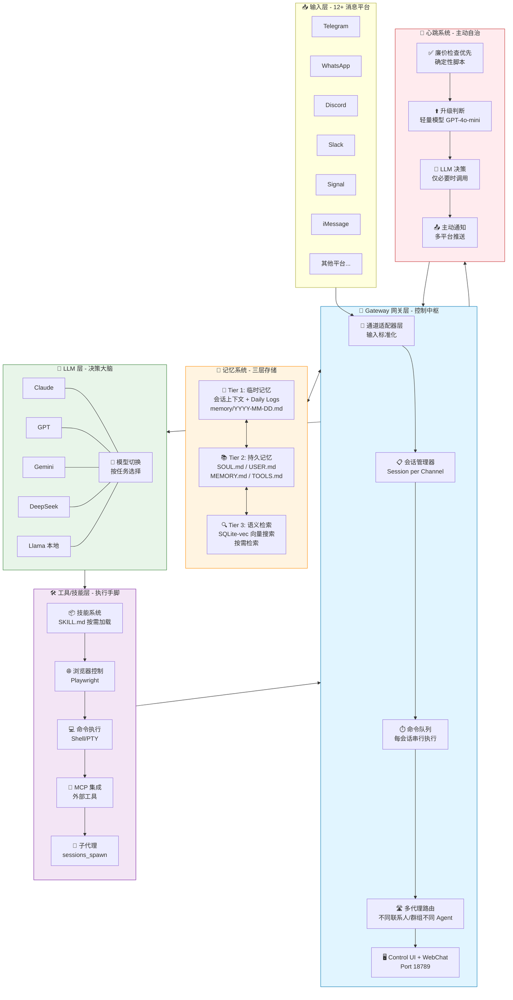
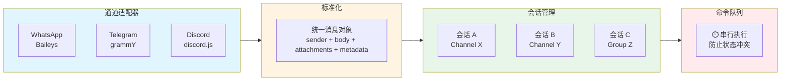
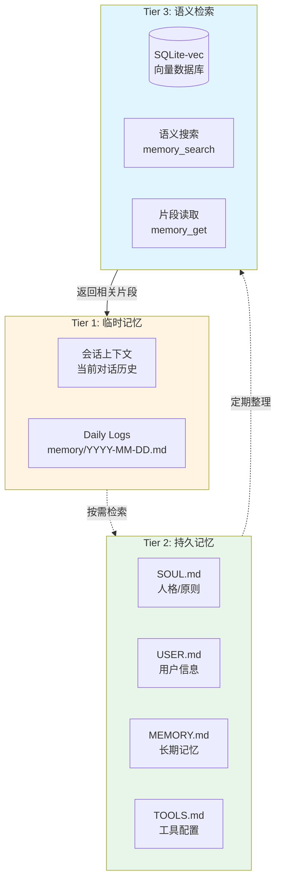
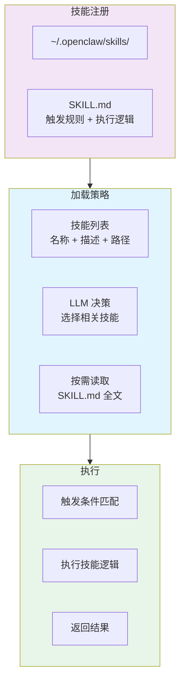
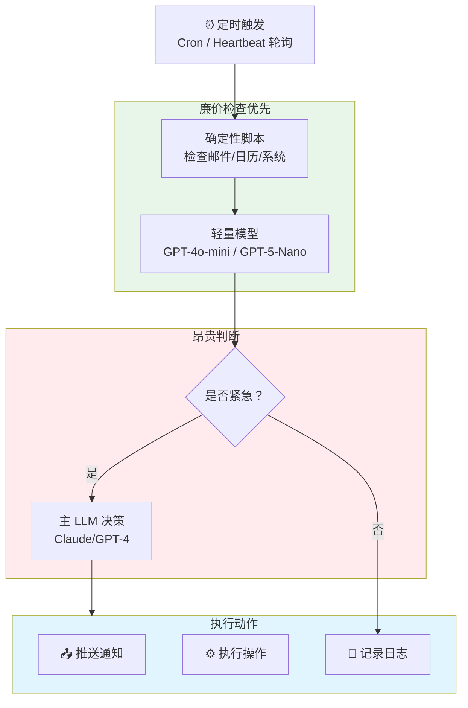
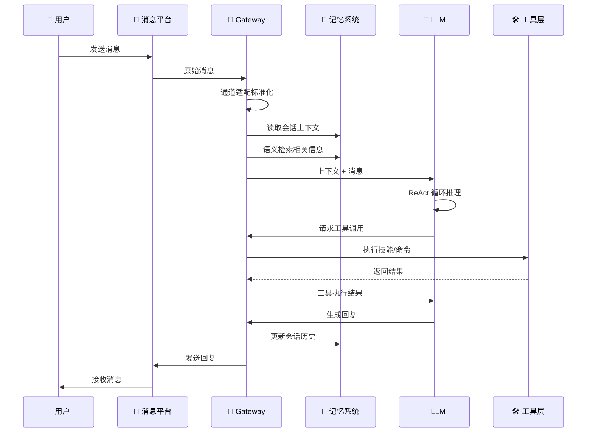
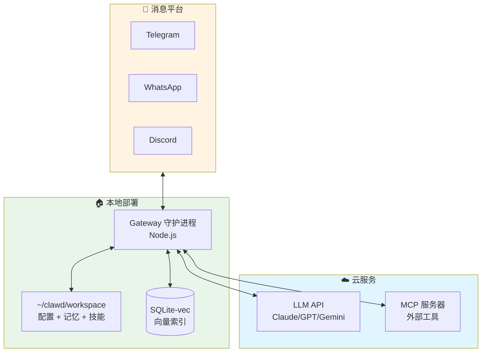
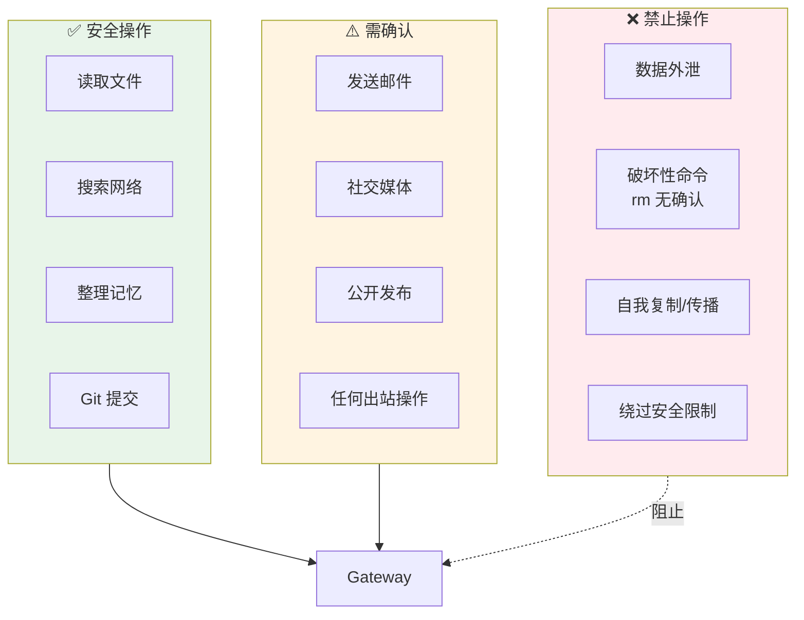

# OpenClaw 技术架构图

## 整体架构概览

---

## 核心组件详解

### 1️⃣ Gateway 网关层（中枢神经）

**关键设计：**
- ✅ **输入标准化**：12+ 平台不同协议 → 统一消息对象
- ✅ **每会话串行**：防止工具冲突和状态不一致
- ✅ **多代理路由**：不同联系人/群组可配置不同 Agent

---

### 2️⃣ 记忆系统（三层架构）

**关键特性：**
- ✅ **无外部数据库**：纯 Markdown + SQLite，简单可靠
- ✅ **按需加载**：不把所有记忆注入上下文，避免膨胀
- ✅ **自动整理**：定期将 Daily Logs 提炼到 MEMORY.md

---

### 3️⃣ 技能系统（USB 式插件）

**关键创新：**
- ✅ **不注入全文**：只注入技能列表，按需读取 SKILL.md
- ✅ **低门槛**：类似 USB 即插即用
- ✅ **社区生态**：ClawHub 技能市场

---

### 4️⃣ 心跳系统（主动自治）

**关键设计：**
- ✅ **廉价优先**：先跑脚本，再升级 LLM
- ✅ **主动通知**：3am 服务器宕机 → Telegram 推送
- ✅ **成本优化**：90% 检查不消耗昂贵 API

---

## 数据流向

---

## 部署架构

**部署特点：**
- ✅ **本地优先**：所有数据存储在本地
- ✅ **混合云**：LLM 可本地可云端
- ✅ **单进程**：单个 Gateway 管理所有会话

---

## 安全边界

---

## 性能优化

| 优化点 | 策略 | 效果 |
|--------|------|------|
| **上下文管理** | 技能列表注入，按需读取 | 减少 90% token 消耗 |
| **会话队列** | 每会话串行执行 | 避免状态冲突 |
| **记忆分层** | 临时/持久/语义三层 | 按需检索，避免膨胀 |
| **心跳分级** | 廉价检查优先 | 减少 90% LLM 调用 |
| **模型切换** | 按任务选择模型 | 成本优化 50-80% |

---

*生成时间：2026-02-23 | 基于 28 个高质量源*
