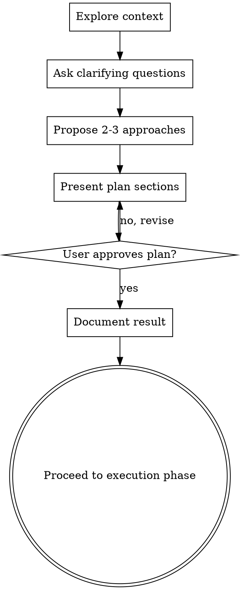

# Brainstorming Ideas and Approaches

## Overview

Help turn ideas into fully formed plans, outlines, or designs through natural collaborative dialogue.

Start by understanding the current context, then ask questions one at a time to refine the idea. Once you understand the goal, present the approach and get user approval.

<HARD-GATE>
Do NOT jump into execution, write code, scaffold projects, or take any final action until you have presented an approach and the user has approved it. This applies to EVERY complex task regardless of perceived simplicity.
</HARD-GATE>

## Anti-Pattern: "This Is Too Simple To Need Planning"

Every complex task goes through this process. A blog post outline, a new feature, a strategic decision, a config change — all of them. "Simple" tasks are where unexamined assumptions cause the most wasted work. The plan can be short (a few sentences for truly simple tasks), but you MUST present it and get approval.

## Checklist

You MUST create a task for each of these items and complete them in order:

1. **Explore context** — check related files, docs, past discussions, or project state
2. **Ask clarifying questions** — one at a time, understand purpose/constraints/success criteria
3. **Propose 2-3 approaches** — with trade-offs and your recommendation
4. **Present final plan/design** — in sections scaled to their complexity, get user approval after each section
5. **Document the result** — write down the agreed-upon plan, explicitly including the **Recommended Approach** and its rationale

## Process Flow

**The terminal state is documenting the result and moving to the actual execution phase.** Ensure there is a clear handoff to whatever role or skill will execute the plan.

## The Process

**Understanding the idea:**
- Check out the current state first (files, context, recent discussions)
- Ask questions one at a time to refine the idea
- Prefer multiple choice questions when possible, but open-ended is fine too
- Only one question per message - if a topic needs more exploration, break it into multiple questions
- Focus on understanding: purpose, constraints, success criteria

**Exploring approaches:**
- Propose 2-3 different approaches with trade-offs
- Present options conversationally with your recommendation and reasoning
- Lead with your recommended option and explain why

**Presenting the plan/design:**
- Once you believe you understand the goal, present the plan
- Scale each section to its complexity: a few sentences if straightforward, up to 200-300 words if nuanced
- Ask after each section whether it looks right so far
- Cover: structure, key components, flow, edge cases, or success metrics (depending on the task)
- Be ready to go back and clarify if something doesn't make sense

## After Brainstorming

**Documentation:**
- Summarize the validated plan/design clearly in the chat
- Only document the plan/design into a dedicated file (e.g., a spec file or markdown document) if the user explicitly requests to persist or save it
- **MUST** clearly include a section for the **Recommended Approach** and the reasons why it was chosen over the alternatives
- Ensure clarity and conciseness

**Execution:**
- Proceed to the execution phase based on the agreed plan (e.g., calling relevant skills, writing code, drafting content)

## Key Principles

- **One question at a time** - Don't overwhelm with multiple questions
- **Multiple choice preferred** - Easier to answer than open-ended when possible
- **Keep it focused (YAGNI)** - Remove unnecessary elements from all plans
- **Explore alternatives** - Always propose 2-3 approaches before settling
- **Incremental validation** - Present plan, get approval before moving on
- **Be flexible** - Go back and clarify when something doesn't make sense
